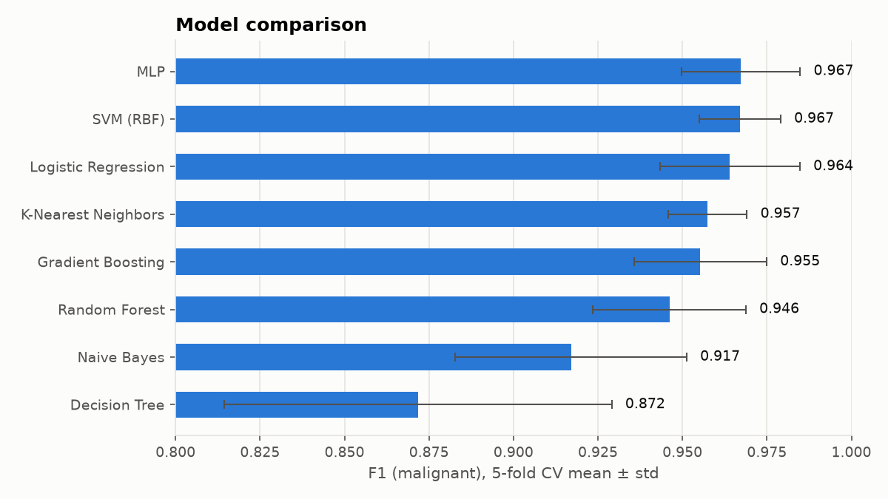
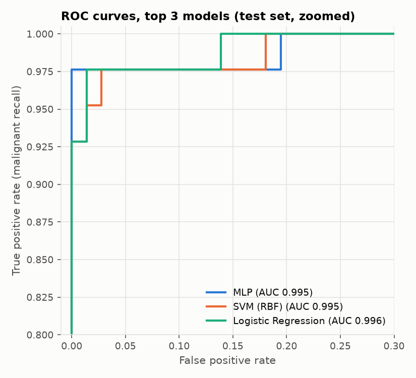
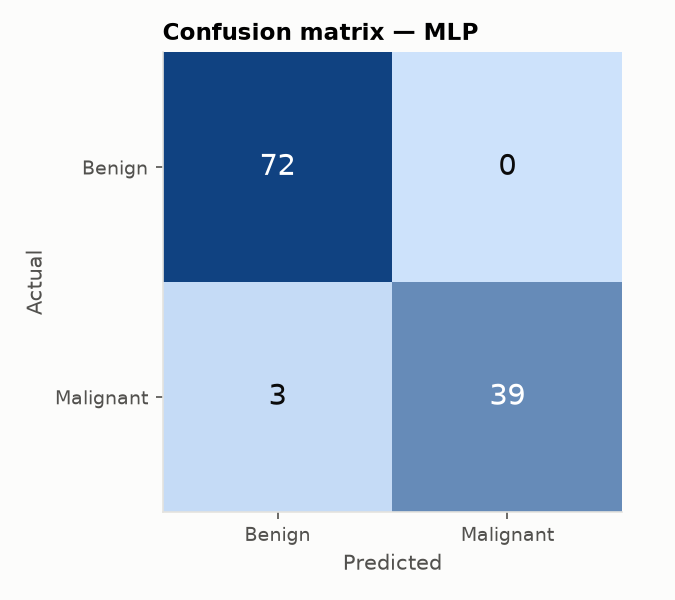

# Breast Cancer Classification

Classifies breast masses as **benign** or **malignant** from 30 cell-nucleus measurements taken from fine-needle aspirate (FNA) images. The repo compares 8 classifiers and serves the best one through a **FastAPI** endpoint.

> ⚠️ This is an educational project. It is not a medical device and must not be used for diagnosis.



## Results

All 8 models were evaluated the same way: a stratified 80/20 train/test split, then 5-fold cross-validation on the training set. Every model sits in a `Pipeline` with its scaler, so scaling is fit on the training folds only. Models are ranked by **mean CV F1 for the malignant class**. The 114-sample test set is only used for the final numbers below.

| Model | CV F1 | CV ROC-AUC | Test Acc | Test Precision | Test Recall | Test F1 | Test ROC-AUC |
|---|---|---|---|---|---|---|---|
| **MLP** | 0.967 | 0.995 | 0.974 | 1.000 | 0.929 | 0.963 | 0.995 |
| SVM (RBF) | 0.967 | 0.995 | 0.974 | 0.976 | 0.952 | 0.964 | 0.995 |
| Logistic Regression | 0.964 | 0.996 | 0.965 | 0.975 | 0.929 | 0.951 | 0.996 |
| K-Nearest Neighbors | 0.957 | 0.986 | 0.956 | 0.974 | 0.905 | 0.938 | 0.982 |
| Gradient Boosting | 0.955 | 0.991 | 0.965 | 1.000 | 0.905 | 0.950 | 0.995 |
| Random Forest | 0.946 | 0.988 | 0.974 | 1.000 | 0.929 | 0.963 | 0.994 |
| Naive Bayes | 0.917 | 0.987 | 0.921 | 0.923 | 0.857 | 0.889 | 0.989 |
| Decision Tree | 0.872 | 0.887 | 0.921 | 0.946 | 0.833 | 0.886 | 0.945 |

**What the numbers say**

- The top three models (MLP, SVM, Logistic Regression) score within about 0.003 F1 of each other, which is well inside the CV standard deviation (about ±0.02). Logistic Regression does just as well as the others and is the easiest to interpret.
- The selected MLP made no false positives on the test set but missed 3 of 42 malignant cases. In a screening setting a missed malignancy costs far more than a false alarm, so a real deployment should lower the decision threshold to favour recall.
- Single trees overfit and come last. Ensembles recover most of the gap.

<p>
  
  
</p>

## Project structure

```
├── app/
│   ├── main.py            # FastAPI app: /health, /model, /predict, /predict/batch
│   └── schemas.py         # Pydantic request/response models
├── src/
│   ├── data.py            # Loading, cleaning, feature list
│   └── train.py           # Model comparison, plots, saves best model
├── data/data.csv          # WDBC dataset (569 samples, 30 features)
├── models/model.joblib    # Best pipeline + metadata (made by src.train)
├── reports/
│   ├── model_comparison.md
│   ├── metrics.json
│   └── figures/
├── notebooks/             # Original exploratory notebooks (EDA + logistic regression)
├── docs/                  # Project presentation
└── tests/                 # pytest suite for the data loader and API
```

## Quickstart

```bash
git clone https://github.com/<your-username>/breast-cancer-classification.git
cd breast-cancer-classification
python -m venv .venv
source .venv/bin/activate        # Windows: .venv\Scripts\activate
pip install -r requirements.txt
```

### Retrain and compare models

```bash
python -m src.train
```

This step rewrites `models/model.joblib`, `reports/metrics.json`, `reports/model_comparison.md` and the figures.

### Run the API

```bash
uvicorn app.main:app --reload
```

Interactive docs open at http://127.0.0.1:8000/docs.

| Method | Endpoint | Description |
|---|---|---|
| GET | `/health` | Liveness check, plus whether the model is loaded |
| GET | `/model` | Model name, feature list, metrics, training timestamp |
| POST | `/predict` | Predict one sample (all 30 features required) |
| POST | `/predict/batch` | Predict up to 1000 samples: `{"samples": [...]}` |

Example request:

```bash
curl -X POST http://127.0.0.1:8000/predict \
  -H "Content-Type: application/json" \
  -d '{
    "radius_mean": 17.99, "texture_mean": 10.38, "perimeter_mean": 122.8, "area_mean": 1001.0,
    "smoothness_mean": 0.1184, "compactness_mean": 0.2776, "concavity_mean": 0.3001,
    "concave_points_mean": 0.1471, "symmetry_mean": 0.2419, "fractal_dimension_mean": 0.07871,
    "radius_se": 1.095, "texture_se": 0.9053, "perimeter_se": 8.589, "area_se": 153.4,
    "smoothness_se": 0.006399, "compactness_se": 0.04904, "concavity_se": 0.05373,
    "concave_points_se": 0.01587, "symmetry_se": 0.03003, "fractal_dimension_se": 0.006193,
    "radius_worst": 25.38, "texture_worst": 17.33, "perimeter_worst": 184.6, "area_worst": 2019.0,
    "smoothness_worst": 0.1622, "compactness_worst": 0.6656, "concavity_worst": 0.7119,
    "concave_points_worst": 0.2654, "symmetry_worst": 0.4601, "fractal_dimension_worst": 0.1189
  }'
```

```json
{"diagnosis": "malignant", "probability_malignant": 1.0}
```

The API rejects a request with HTTP 422 if a feature is missing, a value is negative, or the request includes an unknown field.

### Run tests

```bash
pytest
```

## Dataset

[Breast Cancer Wisconsin (Diagnostic)](https://archive.ics.uci.edu/dataset/17/breast+cancer+wisconsin+diagnostic), UCI Machine Learning Repository. There are 569 samples: 357 benign and 212 malignant. Each sample describes 10 nucleus properties (radius, texture, perimeter, area, smoothness, compactness, concavity, concave points, symmetry, fractal dimension). Each property is given as its mean, its standard error (`_se`) and its worst value (`_worst`), for 30 features in total. In the API, the CSV's `concave points_*` columns are renamed `concave_points_*`.

## Notes on the original notebooks

The notebooks in `notebooks/` contain the first EDA and a logistic regression model. They fit `StandardScaler` on the full dataset **before** the train/test split, which leaks test-set statistics into training. `src/train.py` fixes this by putting the scaler inside each model's pipeline. The old `.pkl` files are kept locally in `models/legacy/`, which is git-ignored.
